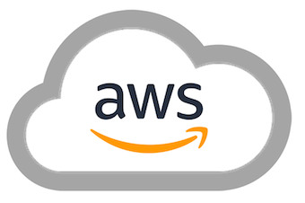

# Visualizing the Software Supply Chain

The software supply chain is under increasing threat.  New attacks and threats have popped up that we couldn't have imagined even two years ago.  Total attacks on the software supply chain are increasing by more than [730% year on year since 2019](https://portswigger.net/daily-swig/researchers-find-633-increase-in-cyber-attacks-aimed-at-open-source-repositories)

Unfortunately, there is no consistent agreement on what is in the software supply chain. This is a problem as we can't secure the software supply chain if we don't know what's in it.  This project aims to help fix that by giving people a visual and contextual way to understand what specific components are in a particular software supply chain.  If you want to tag your own components you can fork this repo and edit it to suit your specific software supply chain profiles. 

## The Software Supply Chain Stages

| [People](PEOPLE.md) | [Local Reqs](LOCAL.md) | [Source Code](CODE.md) | [Integration](INTEGRATION.md) | [Deployment](DEPLOYMENT.md) | [Runtime](RUNTIME.md) | [Hardware](HARDWARE.md) | [DNS](DNS.md)  | [Services](SERVICES.md) | [Cloud](CLOUD.md)
| :---------: | :----------: | :--------------: | :-----------: | :------------------: | :-----------------: | :---------: | :------: | :----------------: | :---------:
|             |              |                  |               |                      |                     |             |          |                    |                 |
| Developers  | IDE          | Languages        | Git repos     | Build solutions      | Servers             | Embedded PC | URL      | SaaS solutions     | CDN             |
| QA team     | SCV          | Frameworks       | SCM providers | Deployment platforms | Operating systems   | PCB         | hostname | Third party APIs   | Cloud services  |
| DevOps team | Local tests  | Libraries        | Pull requests | Unit tests           | Webservers          | USB dongle  |          | Payment gateways   |                 |
|             |              | Open source      |               | Functional tests     | Application servers | GPU/CPU     |          | Identity Providers |                 |
|             |              | Proprietary code |               | Security tests       | Web engines         |             |          | Analytics          |                 |
|             |              |                  |               |                      | Databases           |             |          |                    |                 |
| [People](PEOPLE.md) | [Local Reqs](LOCAL.md) | [Source Code](CODE.md) | [Integration](INTEGRATION.md) | [Deployment](DEPLOYMENT.md) | [Runtime](RUNTIME.md) | [Hardware](HARDWARE.md) | [DNS](DNS.md)  | [Services](SERVICES.md) | [Cloud](CLOUD.md)

## Cloud resources

Cloud native resources refer to the tools, technologies, and infrastructure required to develop, deploy, and manage applications that are designed to run in a cloud environment. These resources typically include containerization platforms, orchestration frameworks, serverless computing, and other cloud-specific technologies.

### What's in scope?

* PaaS
* CDN
* Cloud hosting providers
* Cloud native resources

### Examples

#### PaaS Examples

    

#### CDN Examples

        

#### Cloud hosting providers

      

#### Cloud Native Services

          

DynamoDB, Azure Functions, Microsoft Power Apps, Azure Cosmos, Azure Application Gateway, AWS Elastic Load Balancer, AWS Certificate Manager

