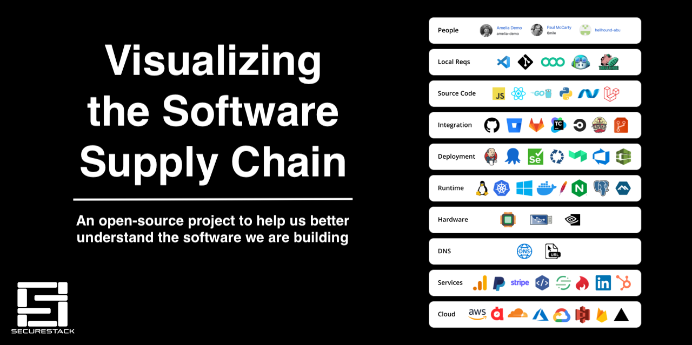

# Visualizing the Software Supply Chain

The software supply chain is under increasing threat.  New attacks and threats have popped up that we couldn't have imagined even two years ago.  Total attacks on the software supply chain are increasing by more than [730% year on year since 2019](https://portswigger.net/daily-swig/researchers-find-633-increase-in-cyber-attacks-aimed-at-open-source-repositories)

Unfortunately, there is no consistent agreement on what is in the software supply chain. This is a problem as we can't secure the software supply chain if we don't know what's in it.  This project aims to help fix that by giving people a visual and contextual way to understand what specific components are in a particular software supply chain.  If you want to tag your own components you can fork this repo and edit it to suit your specific software supply chain profiles. 

## The Software Supply Chain Stages

| [People](docs/PEOPLE.md) | [Local Reqs](docs/LOCAL.md) | [Source Code](docs/CODE.md) | [Integration](docs/INTEGRATION.md) | [Deployment](docs/DEPLOYMENT.md) | [Runtime](docs/RUNTIME.md) | [Hardware](docs/HARDWARE.md) | [DNS](docs/DNS.md)  | [Services](docs/SERVICES.md) | [Cloud](docs/CLOUD.md)
| :---------: | :----------: | :--------------: | :-----------: | :------------------: | :-----------------: | :---------: | :------: | :----------------: | :---------:
|             |              |                  |               |                      |                     |             |          |                    |                 |
| Developers  | IDE          | Languages        | Git repos     | Build solutions      | Servers             | Embedded PC | URL      | SaaS solutions     | CDN             |
| QA team     | SCV          | Frameworks       | SCM providers | Deployment platforms | Operating systems   | PCB         | hostname | Third party APIs   | Cloud services  |
| DevOps team | Local tests  | Libraries        | Pull requests | Unit tests           | Webservers          | USB dongle  |          | Payment gateways   |                 |
|             |              | Open source      |               | Functional tests     | Application servers | GPU/CPU     |          | Identity Providers |                 |
|             |              | Proprietary code |               | Security tests       | Web engines         |             |          | Analytics          |                 |
|             |              |                  |               |                      | Databases           |             |          |                    |                 |
| [People](docs/PEOPLE.md) | [Local Reqs](docs/LOCAL.md) | [Source Code](docs/CODE.md) | [Integration](docs/INTEGRATION.md) | [Deployment](docs/DEPLOYMENT.md) | [Runtime](docs/RUNTIME.md) | [Hardware](docs/HARDWARE.md) | [DNS](docs/DNS.md)  | [Services](docs/SERVICES.md) | [Cloud](docs/CLOUD.md)

## Welcome to the "Visualizing the Software Supply Chain" repository!

You can click on any of the links above and see examples of components sorted by category.  You can also see specific examples of technologies and vendors that fall into that category as well.  Enjoy!

If you want to see everything on one page, you can select [EVERYTHING](./docs/EVERYTHING.md)
