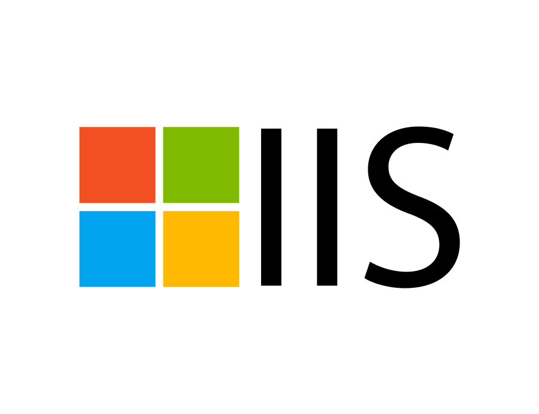
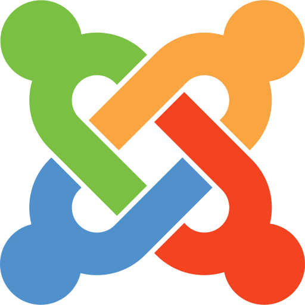
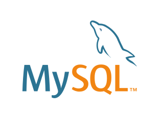

# Visualizing the Software Supply Chain

The software supply chain is under increasing threat.  New attacks and threats have popped up that we couldn't have imagined even two years ago.  Total attacks on the software supply chain are increasing by more than [730% year on year since 2019](https://portswigger.net/daily-swig/researchers-find-633-increase-in-cyber-attacks-aimed-at-open-source-repositories)

Unfortunately, there is no consistent agreement on what is in the software supply chain. This is a problem as we can't secure the software supply chain if we don't know what's in it.  This project aims to help fix that by giving people a visual and contextual way to understand what specific components are in a particular software supply chain.  If you want to tag your own components you can fork this repo and edit it to suit your specific software supply chain profiles. 

## The Software Supply Chain Stages

| [People](#people) | [Local Reqs](#Local-Requirements) | [Source Code](#source-code) | [Integration](#continuous-integration) | [Deployment](#continuous-deployment) | [Runtime](#runtime) | [Hardware](#hardware) | [DNS](#dns)  | [Services](#services) | [Cloud](#cloud-resources)
| :---------: | :----------: | :--------------: | :-----------: | :------------------: | :-----------------: | :---------: | :------: | :----------------: | :---------:
|             |              |                  |               |                      |                     |             |          |                    |                 |
| Developers  | IDE          | Languages        | Git repos     | Build solutions      | Servers             | Embedded PC | URL      | SaaS solutions     | CDN             |
| QA team     | SCV          | Frameworks       | SCM providers | Deployment platforms | Operating systems   | PCB         | hostname | Third party APIs   | Cloud services  |
| DevOps team | Local tests  | Libraries        | Pull requests | Unit tests           | Webservers          | USB dongle  |          | Payment gateways   |                 |
|             |              | Open source      |               | Functional tests     | Application servers | GPU/CPU     |          | Identity Providers |                 |
|             |              | Proprietary code |               | Security tests       | Web engines         |             |          | Analytics          |                 |
|             |              |                  |               |                      | Databases           |             |          |                    |                 |

## People

These are the individuals or teams of people that are needed to write, build and deploy software.

### What's in scope?

* Software engineers
* QA team
* DevOps team

### Examples

#### Developers

&nbsp;&nbsp;

## Local Requirements 

This includes any local applications, configurations, or other dependencies that are needed to for the people building software to successfully do their job.

### What's in scope?

* IDE
* VCS tools
* Local tests

### Examples

#### IDE

    

#### VCS Tools

    

#### Local tests

Linting, static analysis, software composition analysis

&nbsp;&nbsp;

## Source Code

This includes any software that is needed to successfully write, build or deploy an application.  

### What's in scope?

* Programming languages
* Frameworks
* Libraries
* Open source components
* Proprietary code

### Examples

#### Programming Languages

              

#### Frameworks & libraries

                              

## Continuous Integration

Continuous integration (CI) is the process of automatically integrating code changes from multiple contributors into a single software project. This is an important DevOps best practice that enables developers to frequently merge code changes into a central repository for testing before deployment. Automated tools are used to check that the new code is correct before integration.

### What's in scope?

* SCM providers
* Pull requests

### Examples

#### SCM Providers

         

## Continuous deployment

Continuous delivery is an extension of continuous integration that automatically deploys all code changes to a testing and/or production environment after the build stage. This means that in addition to automated testing, you have an automated release process, and can deploy your application at any time by clicking a button.

### What's in scope?

* Build servers
* Deployment platforms
* Security tests
* Functional tests

### Examples

       

Bamboo, Selenium, Semgrep, SecureStack

&nbsp;&nbsp;

## Runtime

The web application runtime is the environment in which a web application is executed. It typically includes the web server, the application server, and other necessary components such as databases, messaging systems, and caching mechanisms. The runtime is responsible for managing the application's resources, handling incoming requests, and returning responses to users.

### What's in scope

* Operating systems
* Webservers
* Application servers
* Content management systems
* Web runtime engines
* Databases
* Containers, AMIs & golden images

### Examples

#### Operating systems

         

#### Webservers

    

Express, Kestrel

#### Application servers

      

#### Content management systems

        

Clarity, Kentico, Sharepoint, Adobe Experience Manager

#### Web runtime

Node.js, WebKit, Chrome, V8 

#### Databases

      

#### Containers, AMIs & Golden Images

Docker, Kubernetes, Amazon Linux, Bitnami WordPress

&nbsp;&nbsp;

## Hardware

This includes any specific or customized piece of hardware for this application to run.  

### What's in scope?

* Proprietary devices
* Dedicated servers

### Examples

Embedded devices, custom PCBs, GPUs

&nbsp;&nbsp;

## DNS

This includes any hostnames, or other DNS entries that any application needs.

### What's in scope?

* DNS

### Examples

app.example.org

&nbsp;&nbsp;

## Services

This refers to the process of identifying and describing the external services that a application relies on in order to function properly. These third-party services can include anything from authentication and authorization services to payment processing and analytics tools.

### What's in scope?

* third party SaaS solutions
* third party APIs or data
* payment processors/gateways
* identity providers 
* analytics & tracking

### Examples

#### Payment gateways & processors

Paypal, Braintree, Stripe, Square

#### SaaS solutions examples

Hubspot, Mailchimp, LinkedIn, Crunchbase

#### Analytics & tracking examples

Mixpanel, Google Analytics, Hotjar, Facebook Pixel, LinkedIn Tracking Pixel, Reddit Pixel, Segment, Marketo

&nbsp;&nbsp;

## Cloud resources

Cloud native resources refer to the tools, technologies, and infrastructure required to develop, deploy, and manage applications that are designed to run in a cloud environment. These resources typically include containerization platforms, orchestration frameworks, serverless computing, and other cloud-specific technologies.

### What's in scope?

* PaaS
* CDN
* Cloud hosting providers
* Cloud native resources

### Examples

#### PaaS Examples

Vercel, Kinsta, Flywheel

Cloudfront, Cloudflare, Fastly, Akamai, Imperva, PeakHour

#### CDN Examples

Cloudfront, Cloudflare, Fastly, Akamai, Imperva, PeakHour

#### Cloud hosting providers

AWS, Azure, GCP, Alibaba 

#### Cloud Native Services

AWS API Gateway, AWS Cognito, DynamoDB, Azure Functions, Firebase, Microsoft Power Apps, Azure Cosmos, Azure Application Gateway, AWS Elastic Load Balancer, AWS Certificate Manager
