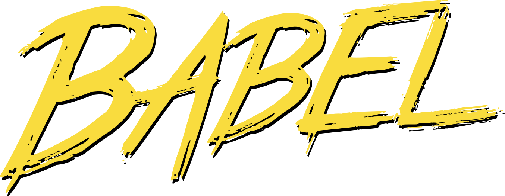
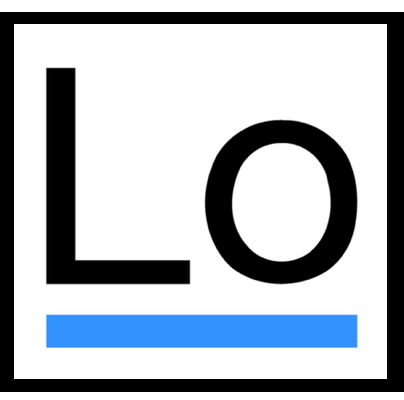

## The Software Supply Chain Stages

| [People](PEOPLE.md#people) | [Local Reqs](LOCAL.md#local-requirements) | [Source Code](CODE.md#source-code) | [Integration](INTEGRATION.md#continuous-integration) | [Deployment](DEPLOYMENT.md#continuous-deployment) | [Runtime](RUNTIME.md#runtime) | [Hardware](HARDWARE.md#hardware) | [DNS](DNS.md#dns)  | [Services](SERVICES.md#services) | [Cloud](CLOUD.md#cloud-resources)
| :---------: | :----------: | :--------------: | :-----------: | :------------------: | :-----------------: | :---------: | :------: | :----------------: | :---------:
|             |              |                  |               |                      |                     |             |          |                    |                 |
| Developers  | IDE          | Languages        | SCM providers | Build solutions      | Servers             | Embedded PC | URL      | SaaS solutions     | CDN             |
| QA team     | SCV          | Frameworks       | Pull requests | Deployment platforms | Operating systems   | PCB         | hostname | Third party APIs   | Cloud services  |
| DevOps team | Local tests  | Libraries        | Secrets mgmt  | Unit tests           | Webservers          | USB dongle  |          | Payment gateways   |                 |
|             | Git repos    | Package Managers |               | Functional tests     | Application servers | GPU/CPU     |          | Identity Providers |                 |
|             |              | Proprietary code |               | Security tests       | Web engines         |             |          | Analytics          |                 |
|             |              | Open source      |               | API test frameworks  | Databases           |             |          |                    |                 |
| [People](PEOPLE.md#people) | [Local Reqs](LOCAL.md#local-requirements) | [Source Code](CODE.md#source-code) | [Integration](INTEGRATION.md#continuous-integration) | [Deployment](DEPLOYMENT.md#continuous-deployment) | [Runtime](RUNTIME.md#runtime) | [Hardware](HARDWARE.md#hardware) | [DNS](DNS.md#dns)  | [Services](SERVICES.md#services) | [Cloud](CLOUD.md#cloud-resources)

## Source Code

This includes any software that is needed to successfully write, build or deploy an application.  

### What's in scope?

* Programming languages
* Frameworks
* Libraries
* Package managers
* Open source components
* Proprietary code

### Examples

#### Programming Languages

                

#### Frameworks & libraries

                              

#### Package managers

            

### Who owns it?

* Development teams
* DevOps team

### How do I secure it?

