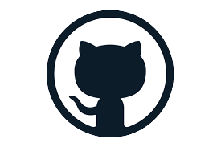
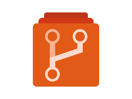
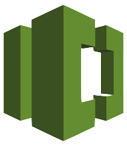

## The Software Supply Chain Stages

| [People](docs/PEOPLE.md#people) | [Local Reqs](docs/LOCAL.md#local-requirements) | [Source Code](docs/CODE.md#source-code) | [Integration](docs/INTEGRATION.md#continuous-integration) | [Deployment](docs/DEPLOYMENT.md#continuous-deployment) | [Runtime](docs/RUNTIME.md#runtime) | [Hardware](docs/HARDWARE.md#hardware) | [DNS](docs/DNS.md#dns)  | [Services](docs/SERVICES.md#services) | [Cloud](docs/CLOUD.md#cloud-resources)
| :---------: | :----------: | :--------------: | :-----------: | :------------------: | :-----------------: | :---------: | :------: | :----------------: | :---------:
|             |               |                  |               |                      |                     |             |          |                    |                 |
| Developers  | IDE           | Languages        | SCM providers | Build solutions      | Servers             | Embedded PC | URL      | SaaS solutions     | CDN             |
| QA team     | SCV           | Frameworks       | Pull requests | Deployment platforms | Operating systems   | PCB         | hostname | Third party APIs   | Cloud services  |
| DevOps team | Local tests   | Libraries        | Secrets mgmt  | Releases             | Webservers          | USB dongle  |          | Payment gateways   |                 |
| Package Maintainers | Git repos     | Package Managers | Git repos     | Functional tests     | Application servers | GPU/CPU     |          | Identity Providers |                 |
|             | Page Builders | Packages         |               | Security tests       | Web engines         |             |          | Analytics          |                 |
|             |               | Open source      |               | API test frameworks  | Databases           |             |          | Proxies            |                 |
|             |               | Proprietary Code |               | Unit tests           |                     |             |          |                    |                 |
|             |               |                  |               |                      |                     |             |          |                    |                 |
| [People](docs/PEOPLE.md#people) | [Local Reqs](docs/LOCAL.md#local-requirements) | [Source Code](docs/CODE.md#source-code) | [Integration](docs/INTEGRATION.md#continuous-integration) | [Deployment](docs/DEPLOYMENT.md#continuous-deployment) | [Runtime](docs/RUNTIME.md#runtime) | [Hardware](docs/HARDWARE.md#hardware) | [DNS](docs/DNS.md#dns)  | [Services](docs/SERVICES.md#services) | [Cloud](docs/CLOUD.md#cloud-resources)

## Continuous Integration

Continuous integration (CI) is the process of automatically integrating code changes from multiple contributors into a single software project. This is an important DevOps best practice that enables developers to frequently merge code changes into a central repository for testing before deployment. Automated tools are used to check that the new code is correct before integration.

### What's in scope?

* SCM providers
* Pull requests

### Examples

#### SCM Providers

         

### Who owns it?

* Engineering leadership
* DevOps team

### What are the security concerns?

* Teams are moving fast, and interating quickly.  It's important that we address security at the speed of iteration
* Use automated security controls to make sure that code is always promoted using guardrails
* Verify developers are who they say they are
* User roles define access

### How do I secure it?

* Git commit signing
* SSH keys for SCM provider
* Pull requests
* Branch protection
* Permissions based SCM roles
* MFA for SCM provider

