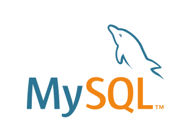
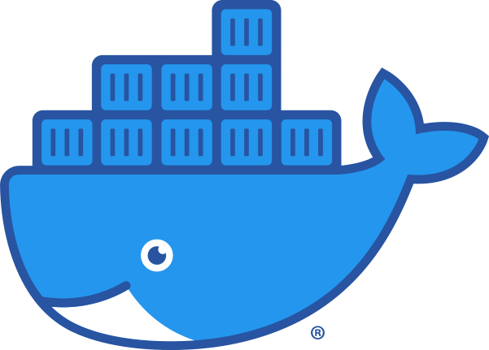
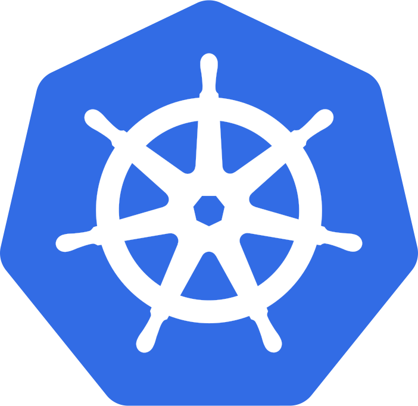

## The Software Supply Chain Stages

| [People](docs/PEOPLE.md#people) | [Local Reqs](docs/LOCAL.md#local-requirements) | [Source Code](docs/CODE.md#source-code) | [Integration](docs/INTEGRATION.md#continuous-integration) | [Deployment](docs/DEPLOYMENT.md#continuous-deployment) | [Runtime](docs/RUNTIME.md#runtime) | [Hardware](docs/HARDWARE.md#hardware) | [DNS](docs/DNS.md#dns)  | [Services](docs/SERVICES.md#services) | [Cloud](docs/CLOUD.md#cloud-resources)
| :---------: | :----------: | :--------------: | :-----------: | :------------------: | :-----------------: | :---------: | :------: | :----------------: | :---------:
|             |               |                  |               |                      |                     |             |          |                    |                 |
| Developers  | IDE           | Languages        | SCM providers | Build solutions      | Servers             | Embedded PC | URL      | SaaS solutions     | CDN             |
| QA team     | SCV           | Frameworks       | Pull requests | Deployment platforms | Operating systems   | PCB         | hostname | Third party APIs   | Cloud services  |
| DevOps team | Local tests   | Libraries        | Secrets mgmt  | Releases             | Webservers          | USB dongle  |          | Payment gateways   |                 |
| Package Maintainers | Git repos     | Package Managers | Git repos     | Functional tests     | Application servers | GPU/CPU     |          | Identity Providers |                 |
|             | Page Builders | Packages         |               | Security tests       | Web engines         |             |          | Analytics          |                 |
|             |               | Open source      |               | API test frameworks  | Databases           |             |          | Proxies            |                 |
|             |               | Proprietary Code |               | Unit tests           |                     |             |          |                    |                 |
|             |               |                  |               |                      |                     |             |          |                    |                 |
| [People](docs/PEOPLE.md#people) | [Local Reqs](docs/LOCAL.md#local-requirements) | [Source Code](docs/CODE.md#source-code) | [Integration](docs/INTEGRATION.md#continuous-integration) | [Deployment](docs/DEPLOYMENT.md#continuous-deployment) | [Runtime](docs/RUNTIME.md#runtime) | [Hardware](docs/HARDWARE.md#hardware) | [DNS](docs/DNS.md#dns)  | [Services](docs/SERVICES.md#services) | [Cloud](docs/CLOUD.md#cloud-resources)

## Runtime

The web application runtime is the environment in which a web application is executed. It typically includes the web server, the application server, and other necessary components such as databases, messaging systems, and caching mechanisms. The runtime is responsible for managing the application's resources, handling incoming requests, and returning responses to users.

### What's in scope

* Operating systems
* Webservers
* Application servers
* Content management systems
* Web runtime engines
* Databases
* Containers, AMIs & golden images

### Examples

#### Operating systems

         

#### Webservers

      

#### Application servers

      

#### Content management systems

        

Clarity, Kentico, Sharepoint, Adobe Experience Manager

#### Web runtime

Node.js, WebKit, Chrome, V8 

#### Databases

      

#### Containers, AMIs & Golden Images

    

### Who owns it?

* CloudOps team
* Operations teams

### Security concerns with runtime components?

* Traditional concerns around server security: patching, firewalls, user access, etc
* Container origin is a huge concern as Docker hub and container registries are prime areas for dependency attacks
* Runtime components have multiple layers of user access controls to worry about
* Golden images and AMIs don't age well, and are often "pinned" in launch 

### How do I secure it?

* Centralized logging
* SIEM
* Intrusion detection/prevention
* OS hardening 
* Web appliation firewall
* Container scanning
* IaC scans
